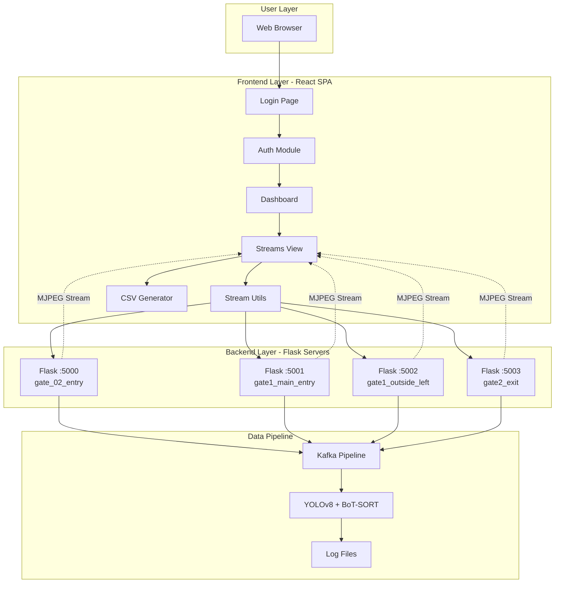
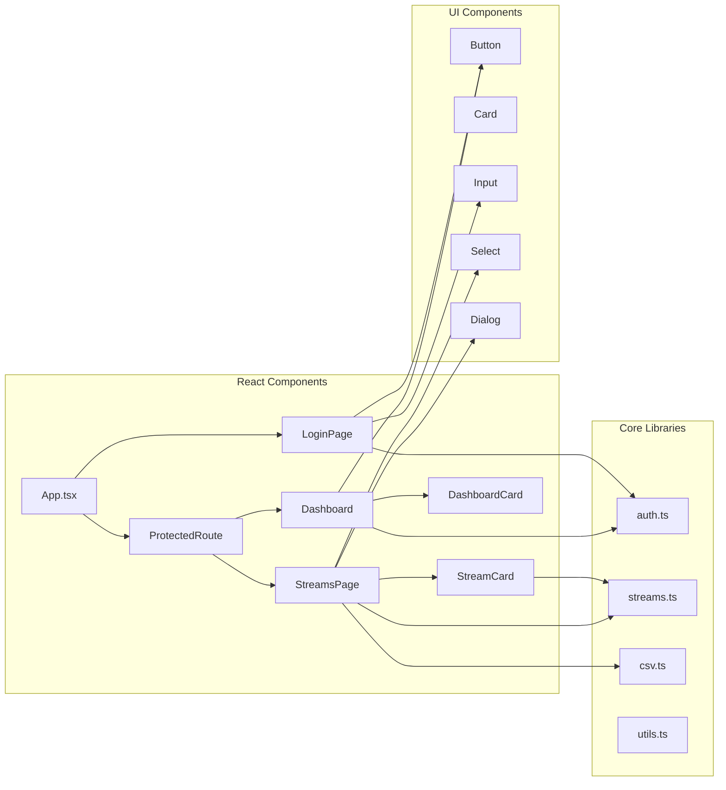
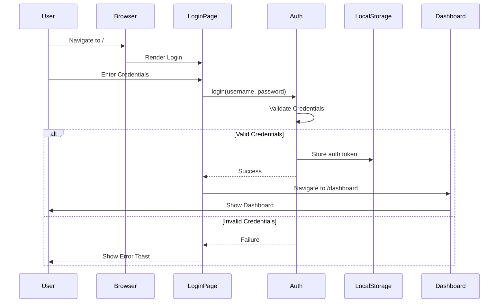
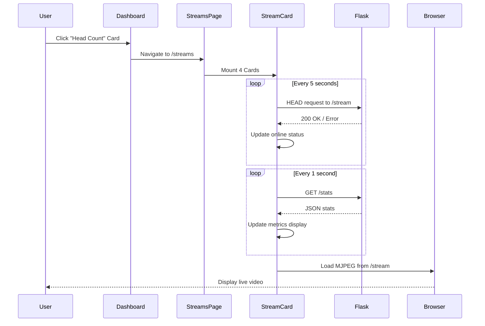
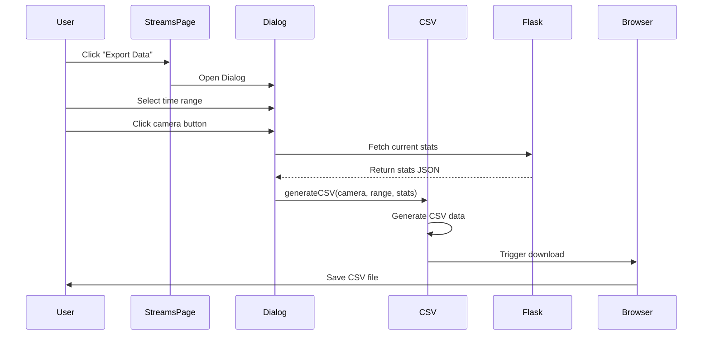
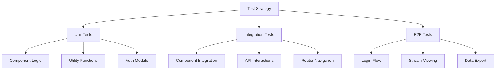

# Knowledge Transfer Document

## System Overview

The Plaksha Living Lab monitoring system is a production-ready, local-first web application designed to display real-time camera streams with AI-powered head counting analytics.

## System Architecture

### High-Level Architecture



### Component Architecture



## Application Lifecycle

### User Authentication Flow



### Stream Viewing Lifecycle



### Data Export Flow



## Data Models

### Stream Configuration

```typescript
interface StreamConfig {
  id: string;              // Unique identifier
  name: string;            // Display name
  location: string;        // Physical location
  model: string;           // ML model description
  streamUrl: string;       // HTTP URL for MJPEG stream
  statsUrl: string;        // HTTP URL for JSON stats
}
```

### Stream Statistics

```typescript
interface StreamStats {
  camera: string;          // Camera identifier
  frames: number;          // Total frames processed
  avg_fps: number;         // Average frames per second
  last_infer_ms: number;   // Last inference time (ms)
  last_head_count: number; // Current head count
  total_heads: number;     // Total heads detected
  utc: string;            // Timestamp (ISO 8601)
}
```

### Authentication User

```typescript
interface AuthUser {
  username: string;        // User identifier
  loginTime: string;       // Login timestamp (ISO 8601)
}
```

## Key Design Decisions

### 1. Local-First Architecture

**Decision**: No cloud dependencies, all data stored and processed locally.

**Rationale**:
- Reduced latency for real-time monitoring
- No external service costs or dependencies
- Complete data ownership and privacy
- Simplified deployment and maintenance

**Implementation**:
- LocalStorage for authentication tokens
- Direct HTTP requests to Flask servers
- Client-side CSV generation
- Static asset hosting

### 2. Component-Based UI

**Decision**: Modular React components with clear separation of concerns.

**Rationale**:
- Reusability and maintainability
- Easier testing and debugging
- Clear component hierarchy
- Simplified onboarding for new developers

**Structure**:
```
Components/
├── Pages (LoginPage, Dashboard, StreamsPage)
├── Feature Components (StreamCard, DashboardCard)
├── Utilities (ProtectedRoute)
└── UI Primitives (shadcn/ui)
```

### 3. Design System Approach

**Decision**: Centralized design tokens in `index.css` with HSL colors.

**Rationale**:
- Consistent visual language
- Easy theme customization
- Dark mode support
- Accessible color combinations

**Implementation**:
```css
:root {
  --primary: 18 55% 48%;      /* Terracotta */
  --secondary: 25 45% 35%;    /* Deep Brown */
  --accent: 35 60% 85%;       /* Cream */
}
```

### 4. Real-Time Updates

**Decision**: Polling-based updates (1s for stats, 5s for online check).

**Rationale**:
- Simpler than WebSockets for this use case
- More reliable with intermittent connections
- Easier to implement and debug
- Acceptable latency for monitoring use case

**Trade-offs**:
- Slightly higher network overhead
- 1-second delay in updates
- More client-side processing

### 5. Error Handling Strategy

**Decision**: Graceful degradation with user feedback.

**Rationale**:
- Better user experience
- Clear error communication
- Maintains functionality when possible
- Debugging information preserved

**Implementation**:
- Try-catch blocks around network requests
- Loading states for async operations
- Toast notifications for errors
- Console logging for debugging

## State Management

### Authentication State

- **Storage**: LocalStorage
- **Key**: `plaksha_auth_token`
- **Structure**: JSON-serialized `AuthUser` object
- **Lifecycle**: Persists across sessions, cleared on logout

### Component State

- **StreamCard**: Individual stats, online status, image errors
- **StreamsPage**: Selected export time range, download status
- **Dashboard**: User information from localStorage

### No Global State

- Decision to avoid Redux/Context for simplicity
- Props and localStorage sufficient for current scale
- Can be refactored if complexity increases

## Security Considerations

### Current Implementation

1. **Authentication**: Basic credential check against hardcoded values
2. **Storage**: Plain text in localStorage
3. **Transport**: HTTP (no HTTPS requirement for local network)

### Production Recommendations

1. **Implement proper backend authentication**:
   - Password hashing (bcrypt, argon2)
   - JWT tokens with expiration
   - Refresh token mechanism

2. **Secure storage**:
   - Encrypted tokens
   - HttpOnly cookies
   - CSRF protection

3. **Transport security**:
   - HTTPS for production
   - Certificate management
   - Security headers

4. **Access control**:
   - Role-based permissions
   - Audit logging
   - Rate limiting

## Performance Considerations

### Current Optimizations

1. **Component memoization**: Not required yet (small component tree)
2. **Image loading**: Browser handles MJPEG streaming
3. **Polling intervals**: Balanced for UX and network load
4. **Build optimization**: Vite's built-in code splitting

### Scaling Considerations

1. **Virtual scrolling**: If adding many more streams
2. **WebSocket upgrade**: For higher stream counts
3. **Edge caching**: For static assets
4. **CDN**: If deployed to multiple locations

## Technology Stack Rationale

### React 18
- **Why**: Industry standard, large ecosystem, excellent documentation
- **Alternatives considered**: Vue, Svelte
- **Key features used**: Hooks, concurrent rendering

### TypeScript
- **Why**: Type safety, better IDE support, catches errors early
- **Alternatives considered**: JavaScript
- **Benefits**: Reduced bugs, better refactoring, self-documenting

### Vite
- **Why**: Fast HMR, modern build tool, excellent DX
- **Alternatives considered**: webpack, Parcel
- **Benefits**: Sub-second rebuilds, optimized production builds

### Tailwind CSS
- **Why**: Utility-first, rapid development, consistent design
- **Alternatives considered**: CSS Modules, Styled Components
- **Benefits**: Small bundle size, design system integration

### shadcn/ui
- **Why**: High-quality components, full customization, accessible
- **Alternatives considered**: Material-UI, Ant Design
- **Benefits**: Copy-paste components, no runtime overhead

## Development Workflow

### Local Development

1. Start dev server: `npm run dev`
2. Access at: `http://localhost:8080`
3. Hot reload enabled
4. TypeScript checking in IDE

### Building for Production

1. Type check: `npm run build`
2. Output: `dist/` folder
3. Preview: `npm run preview`
4. Deploy: Copy `dist/` to server

### Code Quality

1. **Linting**: ESLint with React/TypeScript rules
2. **Type checking**: Strict TypeScript configuration
3. **Formatting**: Built-in Prettier via ESLint
4. **Git hooks**: Pre-commit linting (can be added)

## Testing Strategy

### Current State

- No automated tests currently implemented
- Manual testing workflow established

### Recommended Test Suite



### Recommended Tools

- **Unit**: Vitest + React Testing Library
- **Integration**: Vitest + MSW (Mock Service Worker)
- **E2E**: Playwright or Cypress

## Monitoring and Observability

### Current Capabilities

1. **Browser DevTools**: Network tab for API monitoring
2. **Console Logs**: Error logging to browser console
3. **Visual Indicators**: Online/offline badges, loading states

### Production Recommendations

1. **Error Tracking**: Sentry or similar
2. **Analytics**: Plausible or Matomo (privacy-focused)
3. **Performance Monitoring**: Web Vitals tracking
4. **Logging**: Structured logging to server

## Deployment Environments

### Development
- **URL**: `http://localhost:8080`
- **Server**: Vite dev server
- **Features**: Hot reload, source maps, debug mode

### Production
- **URL**: `http://10.1.40.46` (or custom domain)
- **Server**: Nginx or Apache
- **Features**: Optimized bundle, compression, caching

## Maintenance Guide

### Regular Tasks

1. **Dependency updates**: Monthly `npm update`
2. **Security patches**: Weekly `npm audit fix`
3. **Log rotation**: If implementing server-side logging
4. **Backup**: Regular backup of configuration

### Health Checks

1. **Stream availability**: Monitor Flask server uptime
2. **Application errors**: Check browser console
3. **Performance**: Monitor page load times
4. **Network**: Check bandwidth usage

### Troubleshooting Checklist

1. ✅ Flask servers running?
2. ✅ Network connectivity to 10.1.40.46?
3. ✅ Browser console errors?
4. ✅ CORS issues?
5. ✅ localStorage accessible?
6. ✅ Adequate system resources?

## Future Enhancements

### Potential Features

1. **Multi-user support**: User management system
2. **Real-time alerts**: Threshold-based notifications
3. **Historical data**: Time-series database integration
4. **Mobile app**: React Native version
5. **Advanced analytics**: ML-powered insights
6. **Video recording**: On-demand clip saving
7. **Heat maps**: Crowd density visualization
8. **API integration**: REST API for external systems

### Scalability Roadmap

See [SCALABILITY.md](SCALABILITY.md) for detailed scaling strategies.

## Contact Information

**Project Owner**: Dixon IoT Lab  
**Maintainers**: [Add maintainer contact info]  
**Documentation**: See `/docs` folder  
**Repository**: [Add repository URL]

---

**Document Version**: 1.0  
**Last Updated**: 2025  
**Status**: Production Ready
