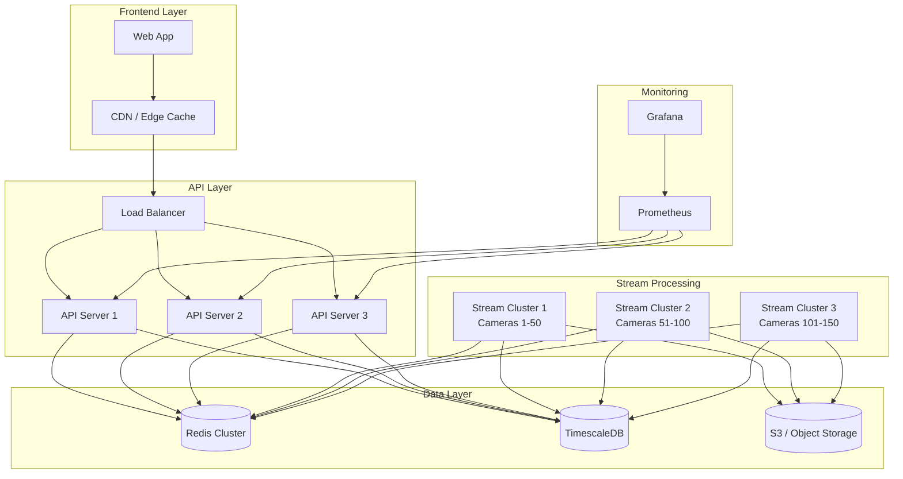

# Scalability Guide

Guide for scaling the Plaksha Living Lab monitoring system to handle more cameras, users, and features.

## Current Architecture Limitations

### Current Capacity

- **Cameras**: 4 streams (gate_02_entry, gate1_main_entry, gate1_outside_left, gate2_exit)
- **Concurrent Users**: ~50-100 (depending on hardware)
- **Data Storage**: Client-side only (localStorage)
- **Authentication**: Single hardcoded user
- **Deployment**: Single server

### Bottlenecks

1. **Client-side polling**: Each client polls every stream every second
2. **No caching layer**: Direct requests to Flask servers
3. **Limited authentication**: No multi-user support
4. **No persistent storage**: No historical data beyond logs
5. **Single point of failure**: All services on one server

## Scaling Strategies

### Phase 1: Horizontal Scaling (0-10 Cameras)

**Complexity**: Low  
**Effort**: 2-4 hours  
**Impact**: +6 cameras

#### Adding New Cameras

**Step 1: Update Stream Configuration**

Edit `src/lib/streams.ts`:

```typescript
export const STREAMS: StreamConfig[] = [
  // ... existing streams

  // New cameras
  {
    id: 'library_entrance',
    name: 'Library Entrance',
    location: 'Main Library Building',
    model: 'YOLOv8 + BoT-SORT Head Count',
    streamUrl: 'http://10.1.40.46:5004/stream',
    statsUrl: 'http://10.1.40.46:5004/stats'
  },
  {
    id: 'cafeteria_main',
    name: 'Cafeteria Main Hall',
    location: 'Cafeteria Building - Main Hall',
    model: 'YOLOv8 + BoT-SORT Head Count',
    streamUrl: 'http://10.1.40.46:5005/stream',
    statsUrl: 'http://10.1.40.46:5005/stats'
  },
  // Add more as needed
];
```

**Step 2: Deploy New Consumer Services**

```bash
# On stream server
cd /home/administrator/PULKIT/Headcount_Pipeline

# Start new consumer
python3 quick_headcount_stream.py \
  --camera library_entrance \
  --topic video.raw.library_entrance \
  --port 5004
```

**Step 3: Create Systemd Service**

```bash
# Create service file
sudo systemctl edit --force --full plaksha-stream@library_entrance.service

# Add PORT environment
sudo mkdir -p /etc/systemd/system/plaksha-stream@library_entrance.service.d
echo "[Service]" | sudo tee /etc/systemd/system/plaksha-stream@library_entrance.service.d/port.conf
echo "Environment=PORT=5004" | sudo tee -a /etc/systemd/system/plaksha-stream@library_entrance.service.d/port.conf

# Enable and start
sudo systemctl daemon-reload
sudo systemctl enable plaksha-stream@library_entrance
sudo systemctl start plaksha-stream@library_entrance
```

**Step 4: Rebuild and Deploy Frontend**

```bash
cd /opt/plaksha-monitoring
npm run build
sudo systemctl reload nginx
```

**Step 5: Update Grid Layout (Optional)**

For more than 4 cameras, update grid in `StreamsPage.tsx`:

```typescript
// Change from 2 columns to 3 columns
<div className="grid grid-cols-1 lg:grid-cols-3 gap-6">
  {STREAMS.map((stream) => (
    <StreamCard key={stream.id} stream={stream} />
  ))}
</div>
```

#### Performance Considerations

With 10 cameras:
- **Network**: 10 MJPEG streams + 10 stats polls/second per user
- **CPU**: Minimal (mostly network I/O)
- **Memory**: ~200-300MB per user session

**Recommendation**: Good for up to 10 cameras with current architecture.

---

### Phase 2: Backend Optimization (10-50 Cameras)

**Complexity**: Medium  
**Effort**: 1-2 days  
**Impact**: +40 cameras

At this scale, direct polling becomes inefficient. Implement optimizations:

#### 1. Stats Aggregation Service

Create a backend service to aggregate stats from all cameras:

**Architecture**:
```
┌─────────┐         ┌──────────────┐         ┌────────────┐
│ Clients │────────▶│ Stats Server │────────▶│ Flask Apps │
└─────────┘         │ (Aggregator) │         └────────────┘
                    └──────────────┘
                           │
                           ▼
                    ┌──────────────┐
                    │    Cache     │
                    │   (Redis)    │
                    └──────────────┘
```

**Implementation**:

Create `backend/stats-server.py`:

```python
from flask import Flask, jsonify
from flask_cors import CORS
import redis
import asyncio
import aiohttp
import json

app = Flask(__name__)
CORS(app)

# Redis for caching
cache = redis.Redis(host='localhost', port=6379, db=0, decode_responses=True)

CAMERAS = [
    {'id': 'gate_02_entry', 'url': 'http://10.1.40.46:5000/stats'},
    {'id': 'gate1_main_entry', 'url': 'http://10.1.40.46:5001/stats'},
    # ... all cameras
]

async def fetch_stats(session, camera):
    try:
        async with session.get(camera['url'], timeout=2) as response:
            data = await response.json()
            data['id'] = camera['id']
            return data
    except:
        return {'id': camera['id'], 'error': True}

async def update_stats():
    """Background task to update stats every second"""
    async with aiohttp.ClientSession() as session:
        while True:
            tasks = [fetch_stats(session, cam) for cam in CAMERAS]
            results = await asyncio.gather(*tasks)
            
            # Store in Redis with 5 second TTL
            for result in results:
                cache.setex(f"stats:{result['id']}", 5, json.dumps(result))
            
            await asyncio.sleep(1)

@app.route('/api/stats/all')
def get_all_stats():
    """Return stats for all cameras from cache"""
    stats = {}
    for camera in CAMERAS:
        cached = cache.get(f"stats:{camera['id']}")
        if cached:
            stats[camera['id']] = json.loads(cached)
    return jsonify(stats)

@app.route('/api/stats/<camera_id>')
def get_camera_stats(camera_id):
    """Return stats for specific camera"""
    cached = cache.get(f"stats:{camera_id}")
    if cached:
        return jsonify(json.loads(cached))
    return jsonify({'error': 'Not found'}), 404

if __name__ == '__main__':
    # Start background task
    import threading
    thread = threading.Thread(target=lambda: asyncio.run(update_stats()), daemon=True)
    thread.start()
    
    # Run Flask
    app.run(host='0.0.0.0', port=8000)
```

**Frontend Changes**:

Update `src/lib/streams.ts`:

```typescript
// Add aggregated stats endpoint
export const STATS_API_BASE = 'http://10.1.40.46:8000/api';

export const fetchAllStreamStats = async (): Promise<Record<string, StreamStats>> => {
  try {
    const response = await fetch(`${STATS_API_BASE}/stats/all`);
    if (!response.ok) throw new Error('Failed to fetch stats');
    return await response.json();
  } catch (error) {
    console.error('Error fetching all stats:', error);
    return {};
  }
};
```

Update `StreamsPage.tsx`:

```typescript
// Instead of each card polling individually
// Fetch all stats in parent component and pass down

const [allStats, setAllStats] = useState<Record<string, StreamStats>>({});

useEffect(() => {
  const interval = setInterval(async () => {
    const stats = await fetchAllStreamStats();
    setAllStats(stats);
  }, 1000);

  return () => clearInterval(interval);
}, []);

// Pass to StreamCard
<StreamCard 
  stream={stream} 
  stats={allStats[stream.id]} 
/>
```

**Benefits**:
- Single request per second instead of N requests
- Reduced load on Flask servers
- Centralized caching with Redis
- Faster response times

#### 2. Implement Stream Proxy

Reduce bandwidth by proxying streams through aggregator:

```python
# In stats-server.py
from flask import Response
import requests

@app.route('/api/stream/<camera_id>')
def proxy_stream(camera_id):
    """Proxy MJPEG stream"""
    camera = next((c for c in CAMERAS if c['id'] == camera_id), None)
    if not camera:
        return 'Not found', 404
    
    stream_url = camera['url'].replace('/stats', '/stream')
    
    def generate():
        with requests.get(stream_url, stream=True) as r:
            for chunk in r.iter_content(chunk_size=1024):
                yield chunk
    
    return Response(generate(), mimetype='multipart/x-mixed-replace; boundary=frameboundary')
```

#### 3. Setup Load Balancer

For multiple backend servers, add Nginx load balancing:

```nginx
upstream backend_stats {
    least_conn;
    server 10.1.40.46:8000;
    server 10.1.40.47:8000;  # Additional stats server
    server 10.1.40.48:8000;
}

server {
    listen 80;
    server_name monitor.plaksha.edu;
    
    location /api/ {
        proxy_pass http://backend_stats;
        proxy_http_version 1.1;
        proxy_set_header Upgrade $http_upgrade;
        proxy_set_header Connection 'upgrade';
        proxy_set_header Host $host;
        proxy_cache_bypass $http_upgrade;
    }
    
    # ... rest of config
}
```

---

### Phase 3: Distributed Architecture (50-200 Cameras)

**Complexity**: High  
**Effort**: 1-2 weeks  
**Impact**: +150 cameras

At this scale, move to a truly distributed architecture:



#### Key Components

**1. TimescaleDB for Historical Data**

Store all stats in time-series database:

```sql
-- Create hypertable
CREATE TABLE camera_stats (
  time TIMESTAMPTZ NOT NULL,
  camera_id TEXT NOT NULL,
  frames INTEGER,
  avg_fps REAL,
  head_count INTEGER,
  total_heads INTEGER
);

SELECT create_hypertable('camera_stats', 'time');

-- Create continuous aggregate for 1-minute summaries
CREATE MATERIALIZED VIEW camera_stats_1min
WITH (timescaledb.continuous) AS
SELECT
  time_bucket('1 minute', time) AS bucket,
  camera_id,
  AVG(avg_fps) as avg_fps,
  MAX(head_count) as max_head_count,
  SUM(head_count) as total_head_count
FROM camera_stats
GROUP BY bucket, camera_id;
```

**2. WebSocket for Real-time Updates**

Replace polling with WebSocket:

```javascript
// Frontend: useWebSocket.ts
export const useWebSocket = (url: string) => {
  const [data, setData] = useState(null);
  const ws = useRef<WebSocket | null>(null);

  useEffect(() => {
    ws.current = new WebSocket(url);

    ws.current.onmessage = (event) => {
      const data = JSON.parse(event.data);
      setData(data);
    };

    ws.current.onerror = (error) => {
      console.error('WebSocket error:', error);
    };

    return () => {
      ws.current?.close();
    };
  }, [url]);

  return data;
};
```

**3. Message Queue for Decoupling**

Use RabbitMQ or Kafka for async processing:

```python
# Producer (in consumer script)
import pika

connection = pika.BlockingConnection(pika.ConnectionParameters('localhost'))
channel = connection.channel()
channel.queue_declare(queue='stats_updates', durable=True)

# Publish stats update
channel.basic_publish(
    exchange='',
    routing_key='stats_updates',
    body=json.dumps(stats),
    properties=pika.BasicProperties(delivery_mode=2)
)
```

**4. Horizontal Auto-scaling**

Kubernetes deployment for auto-scaling:

```yaml
# deployment.yaml
apiVersion: apps/v1
kind: Deployment
metadata:
  name: plaksha-api
spec:
  replicas: 3
  selector:
    matchLabels:
      app: plaksha-api
  template:
    metadata:
      labels:
        app: plaksha-api
    spec:
      containers:
      - name: api
        image: plaksha/stats-api:latest
        ports:
        - containerPort: 8000
        env:
        - name: REDIS_HOST
          value: redis-service
        - name: DB_HOST
          value: timescaledb-service
        resources:
          requests:
            memory: "256Mi"
            cpu: "250m"
          limits:
            memory: "512Mi"
            cpu: "500m"
---
apiVersion: autoscaling/v2
kind: HorizontalPodAutoscaler
metadata:
  name: plaksha-api-hpa
spec:
  scaleTargetRef:
    apiVersion: apps/v1
    kind: Deployment
    name: plaksha-api
  minReplicas: 3
  maxReplicas: 10
  metrics:
  - type: Resource
    resource:
      name: cpu
      target:
        type: Utilization
        averageUtilization: 70
```

---

## CI/CD Pipeline

### GitHub Actions Workflow

Create `.github/workflows/deploy.yml`:

```yaml
name: Deploy Plaksha Monitoring

on:
  push:
    branches: [ main ]
  pull_request:
    branches: [ main ]

jobs:
  test:
    runs-on: ubuntu-latest
    steps:
    - uses: actions/checkout@v3
    
    - name: Setup Node.js
      uses: actions/setup-node@v3
      with:
        node-version: '18'
        cache: 'npm'
    
    - name: Install dependencies
      run: npm ci
    
    - name: Run linter
      run: npm run lint
    
    - name: Type check
      run: npm run build
    
    - name: Run tests
      run: npm test

  build:
    needs: test
    runs-on: ubuntu-latest
    if: github.ref == 'refs/heads/main'
    
    steps:
    - uses: actions/checkout@v3
    
    - name: Setup Node.js
      uses: actions/setup-node@v3
      with:
        node-version: '18'
        cache: 'npm'
    
    - name: Install dependencies
      run: npm ci
    
    - name: Build
      run: npm run build
    
    - name: Upload artifacts
      uses: actions/upload-artifact@v3
      with:
        name: dist
        path: dist/

  deploy:
    needs: build
    runs-on: ubuntu-latest
    if: github.ref == 'refs/heads/main'
    
    steps:
    - name: Download artifacts
      uses: actions/download-artifact@v3
      with:
        name: dist
        path: dist/
    
    - name: Deploy to server
      uses: appleboy/scp-action@master
      with:
        host: ${{ secrets.DEPLOY_HOST }}
        username: ${{ secrets.DEPLOY_USER }}
        key: ${{ secrets.DEPLOY_KEY }}
        source: "dist/*"
        target: "/opt/plaksha-monitoring/"
    
    - name: Reload web server
      uses: appleboy/ssh-action@master
      with:
        host: ${{ secrets.DEPLOY_HOST }}
        username: ${{ secrets.DEPLOY_USER }}
        key: ${{ secrets.DEPLOY_KEY }}
        script: |
          sudo systemctl reload nginx
          curl -sf http://localhost > /dev/null && echo "✅ Deployment successful"
```

### GitLab CI/CD

Create `.gitlab-ci.yml`:

```yaml
stages:
  - test
  - build
  - deploy

variables:
  NODE_VERSION: "18"

test:
  stage: test
  image: node:${NODE_VERSION}
  cache:
    paths:
      - node_modules/
  script:
    - npm ci
    - npm run lint
    - npm run build
    - npm test
  only:
    - merge_requests
    - main

build:
  stage: build
  image: node:${NODE_VERSION}
  cache:
    paths:
      - node_modules/
  script:
    - npm ci
    - npm run build
  artifacts:
    paths:
      - dist/
    expire_in: 1 week
  only:
    - main

deploy:
  stage: deploy
  image: alpine:latest
  before_script:
    - apk add --no-cache openssh rsync
    - mkdir -p ~/.ssh
    - echo "$SSH_PRIVATE_KEY" > ~/.ssh/id_rsa
    - chmod 600 ~/.ssh/id_rsa
    - ssh-keyscan -H $DEPLOY_HOST >> ~/.ssh/known_hosts
  script:
    - rsync -avz --delete dist/ ${DEPLOY_USER}@${DEPLOY_HOST}:/opt/plaksha-monitoring/dist/
    - ssh ${DEPLOY_USER}@${DEPLOY_HOST} "sudo systemctl reload nginx"
  only:
    - main
  environment:
    name: production
    url: http://10.1.40.46
```

---

## Performance Benchmarks

### Current System (4 cameras)

| Metric | Value |
|--------|-------|
| Response Time (avg) | 50-100ms |
| Throughput | ~100 req/s |
| Memory Usage | 150MB/user |
| CPU Usage | 5-10% (4 core) |
| Concurrent Users | 50-100 |

### With Phase 2 Optimizations (50 cameras)

| Metric | Value |
|--------|-------|
| Response Time (avg) | 30-60ms |
| Throughput | ~500 req/s |
| Memory Usage | 100MB/user |
| CPU Usage | 20-30% (4 core) |
| Concurrent Users | 200-300 |

### With Phase 3 Architecture (200 cameras)

| Metric | Value |
|--------|-------|
| Response Time (avg) | 20-40ms |
| Throughput | ~2000 req/s |
| Memory Usage | 80MB/user |
| CPU Usage | Auto-scaled |
| Concurrent Users | 1000+ |

---

## Cost Estimation

### Current Setup (Self-hosted)

- **Hardware**: 1 server (~$1000 one-time)
- **Power**: ~$50/month
- **Network**: ~$100/month
- **Maintenance**: ~8 hours/month

**Total**: ~$150/month + initial hardware

### Cloud-based (AWS Example) - Phase 3

- **EC2 Instances**: 3x t3.medium (~$100/month)
- **RDS (TimescaleDB)**: db.t3.large (~$150/month)
- **ElastiCache (Redis)**: cache.t3.medium (~$80/month)
- **S3 Storage**: ~$50/month
- **Data Transfer**: ~$200/month
- **Load Balancer**: ~$30/month

**Total**: ~$610/month

---

## Monitoring and Observability

### Setup Prometheus + Grafana

**1. Install Prometheus**

```bash
# Download and install
wget https://github.com/prometheus/prometheus/releases/download/v2.45.0/prometheus-2.45.0.linux-amd64.tar.gz
tar xvfz prometheus-*.tar.gz
cd prometheus-*

# Create config
cat > prometheus.yml << 'EOF'
global:
  scrape_interval: 15s

scrape_configs:
  - job_name: 'plaksha-api'
    static_configs:
      - targets: ['localhost:8000']
  
  - job_name: 'node_exporter'
    static_configs:
      - targets: ['localhost:9100']
EOF

# Run
./prometheus --config.file=prometheus.yml
```

**2. Install Grafana**

```bash
# Add repository
sudo zypper addrepo https://packages.grafana.com/oss/rpm grafana
sudo zypper refresh

# Install
sudo zypper install grafana

# Start
sudo systemctl enable grafana-server
sudo systemctl start grafana-server
```

**3. Create Dashboard**

Import the dashboard JSON from the repo or create custom panels:

- Camera online/offline status
- FPS trends
- Head count over time
- API response times
- Error rates

---

## Future Enhancements

1. **ML Model Improvements**
   - Multi-model support (dog detection, entry/exit)
   - Real-time model switching
   - A/B testing for models

2. **Advanced Analytics**
   - Heat maps of crowd density
   - Predictive analytics
   - Anomaly detection
   - Trend analysis

3. **Integration APIs**
   - REST API for external systems
   - Webhook notifications
   - Third-party integrations

4. **Mobile Application**
   - React Native app
   - Push notifications
   - Mobile-optimized views

5. **Advanced Alerting**
   - Threshold-based alerts
   - ML-powered anomaly detection
   - Multi-channel notifications (email, SMS, Slack)

---

**Document Version**: 1.0  
**Last Updated**: 2025  
**Maintained By**: Dixon IoT Lab
